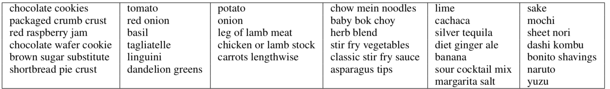
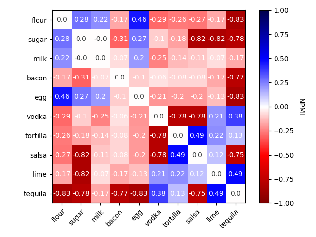

# Signed Spectral Clustering

Implementation of the Signed Normalized Cuts algorithm described in [Gallier (2016)](https://arxiv.org/pdf/1601.04692.pdf).

## Sample Output

  

  Figure 1: Sample ingredient clusters

  

  Figure 2: Ingredient affinity matrix computed by pairwise normalized PMI (NPMI) scores

## Organization

* `ssc.py` contains the signed normalized cuts implementation
* `affinities.py` generates an affinity matrix from a recipe dataset, clusters the ingredients, and performs various recipe rating prediction experiments using the clusters as features.

See `Report.pdf` for a thorough discussion of the implementation and application to recipe rating predictions.
